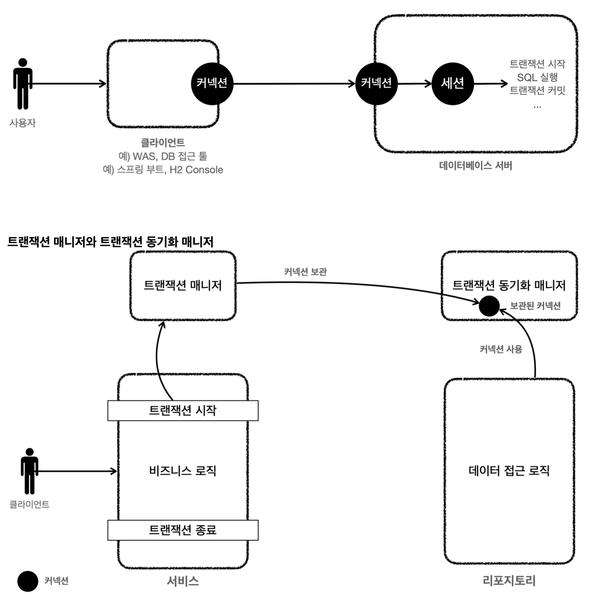

#스프링의 예외추상화
## 자바/스프링 예외처리
- 체크 예외와 언체크 예외
  - 체크 예외 : 컴파일러가 체크, 처리`catch`/던짐`throws` 필수 - 그렇지 않으면 컴파일 오류가 발생한다.
  - 언체크 예외 : 컴파일러가 체크 하지 않음. 따로 처리하거나 던지지 않으면 자동으로 던져짐.
- 비즈니스 활용
  - 기본적으로는 언체크(런타임) 예외를 사용한다
  - 비즈니스 로직상 의도적으로 던져야 하는 경우에만 체크 예외를 사용한다.
  - 체크 예외 문제점과 해결방안
    - 복구 불가능한 예외
      - 복구가 불가능한 문제들을 일관성 있게 공통으로 처리하는 것이 나아보임 -> `servlet filter`, `spring interceptor`, `controllerAdvice`
    - 의존 관계 문제
      - 체크예외는 무조건 던지거나 잡아야 해서, 복구 불가능한 예외인데도 불구하고 다른 계층에서도 예외를 전달 받아 다시 던져야 한다.
      - 만약 repo에서 발생한 db 예외때문에 다른 계층에 다 throws를 해줬다면, db를 바꿔 예외내용이 바뀔 때 파급력이 높아진다.
    - 해결방안 : 예외 전환
      - 체크 예외를 언체크 예외로 전환해서 예외를 던진다.
      - 예외 전환을 사용할 시, 문서화를 잘 해야하고 중요한 예외는 생략가능하지만 굳이 `throws`를 기입해 경각심을 주는 것이 좋다.
      - 또한 기존 예외를 포함해서 예외를 전환해야 스택 트레이스 확인 시 문제가 발생하지 않는다.
      ```java
      public void call() {
       try {
           runSQL();
       } catch (SQLException e) {
       throw new RuntimeSQLException(e); //기존 예외(e) 포함 }
       }
      ```
      - 주요 토픽은 서비스 계층을 특정 구현 기술에 의존시키지 않고 순수하게 유지 하는 것이다.
      - 예외 전환을 이용해서 순수함을 유지했을 때, 일부 예외는 복구가 가능해서 예외를 잡고 싶을 때가 있을 것이다.
      - 그럴 때에는 전환한 예외의 하위 계층으로 예외 클래스를 직접 만들어 처리할 수 있다.
        - 직접 만든 예외이기 때문에 기술에 종속적이지 않을 수 있다.
    ```java
    // ====== Service
    try {
          repository.save(new Member(memberId, 0));
          log.info("saveId={}", memberId);
         } catch (MyDuplicateKeyException e) { // 복구 가능한 예외 (커스텀, MyDbException 하위 클래스)
          log.info("키 중복, 복구 시도");
          String retryId = generateNewId(memberId); log.info("retryId={}", retryId); repository.save(new Member(retryId, 0));
          } catch (MyDbException e){ // 복구 불가능한 예외 
         log.info("데이터 접근 계층 예외", e); throw e;
    }
    // ======= Repository 예외전환 : SQLException -> MyDbException or MyDuplicateKeyException
        catch (SQLException e) {
            //h2 db
              if (e.getErrorCode() == 23505) { 
              throw new MyDuplicateKeyException(e);
            }
            throw new MyDbException(e);
    ```   

### 스프링의 예외처리
- 위 처럼 특정 예외는 잡아 처리하고 싶을 땐, 해당 DB에 맞는 `ErrorCode`를 직접 조건문에 대조하여 구분해주어야 했다.
- 이 같은 불편함을 해결하기 위해 스프링은 데이터 접근과 관련된 예외를 특정 기술에 종속적이지 않게 추상화해서 제공한다.
- JDBC나 JPA를 사용할 때 발생하는 예외를 스프링이 제공하는 예외로 변환해주는 역할도 제공한다.
---
## 데이터 접근 기술의 추상화 
- 데이터소스, 트랜잭션 매니저

### DataSource
- 커넥션을 획득하는 방법을 추상화한 인터페이스 (주 기능: 커넥션 풀에서 커넥션 조회)
- 커넥션을 직접 생성하는 `DriverManager`는 해당 인터페이스를 사용하지 않음. 따라서 해당 클래스를 사용하기 보단
  스프링에서 제공하는 `DataSource`를 구현한 `DriverManagerDataSource` 사용 권장

## 트랜잭션 적용
- 스프링 트랜잭션 등장 전 단점
  - 트랜잭션을 비즈니스 로직이 있는 서비스 계층에서 시작하는 것이 좋은데,
  1. 구현하려면 서비스 계층이 JDBC 기술에 의존하게 되며 db 관련 예외도 누수된다.
  2. 같은 트랜잭션을 유지하기 위해 커넥션을 파라미터로 넘기게 되면서 똑같은 기능도 트랜잭션용과 아닌것으로 분리해야 한다.
  3. 트랜잭션을 적용하기 위해 반복 코드가 많아진다 : try, catch, finally..

### 스프링 트랜잭션
- 트랜잭션 추상화, 리소스 동기화 : 트랜잭션 매니저 `PlatformTransactoinManager`
  - 트랜잭션 추상화
    - 구현 기술에 따라 트랜잭션 사용법이 다르다. `con.setAutoCommit(false)` ,`transaction.begin()` ...
    - 따라서 트랜잭션을 인터페이스로 추상화 하고, 구현 기술에 알맞은 구현체를 주입하는 방식을 이용한다.
    ```java
     public interface TxManager {
          getTransaction();
          commit();
          rollback();
    }
    ```
    - 스프링에서는 위의 `TxManager`와 같은 `PlatformTransactoinManager`라는 인터페이스를 만들어 두었고
    - 데이터 접근 기술별 해당 인터페이스 구현체 또한 대부분 만들어 두어 개발자가 가져다 사용하기만 하면 된다.
  - 리소스 동기화
    - 트랜잭션을 유지하려면 트랜잭션의 처음부터 끝까지 같은 커넥션을 유지해야 한다.
    - 스프링 사용 전에는 파라미터로 전달하는 방법을 사용하여 단점이 있었다.
      
    - 스프링이 제공하는 트랜잭션 동기화 매니저는 쓰레드 로컬을 사용해서 커넥션을 동기화해준다.
    - 트랜잭션 매니저는 내부에서 이 트랜잭션 동기화 매니저를 사용한다.
    - `org.springframework.transaction.support.TransactionSynchronizationManager`
    - 트랜잭션을 사용하기 위해 동기화된 커넥션은 커넥션을 닫지 않고 그대로 유지해준다. 트랜잭션 동기화 매니저가 관리하는 커넥션이 없는 경우 해당 커넥션을 닫는다.

- 트랜잭션 AOP
  - 프록시를 도입하기 전에는 서비스로직에서 트랜잭션을 직접 시작하며 순수한 서비스계층 유지가 어려웠다.
    - 프록시가 서비스 계층 대신 그 전에 트랜잭션 관련 코드를 처리해주며 서비스게층은 순수한 비즈니스 로직만을 남길 수 있다.
    - 클라이언트 -> 트랜잭션 프록시 (트랜잭션 처리 로직) -> 서비스 (비즈니스 로직) -> 리포지토리 (데이터 접근 로직)
  - 트랜잭션 처리가 필요한 곳에 `@Transactional`을 붙여주면 스프링의 트랜잭션 AOP는 트랜잭션 프록시를 적용해준다 .
    - 스프링 AOP를 적용하려면 어드바이저, 포인트컷, 어드바이스가 필요하고 스프링은 해당 클래스들을 제공한다. 스프링부트를 사용하면 해당 빈들은 스프링 컨테이너에 자동 등록된다.
  - 트랜잭션 AOP 적용 후 흐름
    

### 스프링 부트의 자동 리소스 등록
- 데이터 소스 `DataSource` , 트랜잭션 매니저 `PlatformTransactionManager`
- 데이터 소스 - `dataSource` 라는 이름으로 스프링 빈에 자동 등록한다.
  - 등록 시, `application.propertise`에 있는 속성을 사용해서 등록한다. (url, username, password 등
  - 스프링 부트가 기본으로 생성하는 데이터소스는 커넥션풀을 제공하는 `HikariDataSource`
  - url 속성이 없으면 내장 데이터베이스를 생성하려고 시도한다.
- 트랜잭션 매니저  - `transactionManager` 으로 등록한다.
  - 어떤 트랜잭션 매니저를 선택할지는 등록된 라이브러리를 보고 알아서 판단한다. (JDBC or JPA 등등..)

---
# 파일 설명
- MemberReposirotyV0
    - 순수 데이터 접근 방법
    - JDBC - DriverManager 사용
- MemberReposirotyV1
    - 커넥션 풀 사용 with Datasource인터페이스
- MemberServiceV1
    - 트랜잭션 사용 안 한 서비스 로직
- MemberReposirotyV2,MemberServiceV2
    - Connection 유지를 위한 코드 변경
    - Connection 파라미터화, 서비스계층에서 close

---